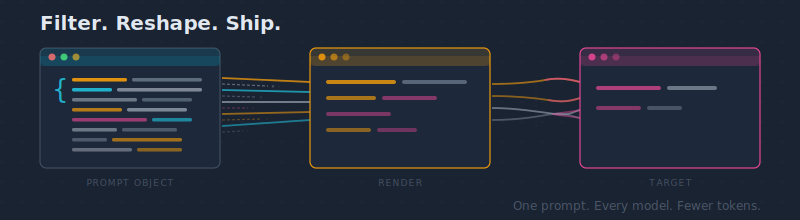

# Renderable Prompt Object (RPO)

> **Motto:** schema stays rich; renderer stays lean

<p align="center">
  
</p>

RPO is a **prompt intermediate representation** (IR): a small JSON schema for capturing *rules + state + task + output contract*, then **rendering** it into the exact format each target needs — fewer tokens, every model.

> Status: early v0 (spec/examples first; CLI/package catching up). Created 2026-02-07.

## Start here

Docs:
- [docs/tldr.md](./docs/tldr.md) — **TLDR: plain-English explainer** (start here if you're new)
- [docs/llm-card.md](./docs/llm-card.md) — canonical RPO shape (rules/state/task/output contract)
- [docs/rubric.md](./docs/rubric.md) — contract/rubric (what “good” looks like)
- [docs/research/rpo-academic-research-2026-02-10.md](./docs/research/rpo-academic-research-2026-02-10.md) — deep research packet (start here if you want the academic backbone)
- [docs/](./docs/) — docs index
- [docs/research/](./docs/research/) — research index

Examples:
- [examples/01-simple-codegen.json](./examples/01-simple-codegen.json) — smallest end-to-end example
- [examples/90-research-round.json](./examples/90-research-round.json) + [modes/research.mode.md](./modes/research.mode.md) — richer research workflow example

## ✅ What it is
- A **structured prompt object** (not one giant string)
- A **validator** (schema + constraints)
- A set of **renderers** (Chat UI, API/provider formats)

## Why it matters
Prompts rot because they're unreviewable blobs. RPO makes prompt changes:
- **reviewable** — data diffs, not string diffs
- **testable** — snapshot rendered outputs
- **portable** — one object, many targets, fewer tokens

## Who should use it
- Teams shipping agents/prompts (code review / versioning)
- Anyone maintaining "modes" or reusable prompt templates
- Tooling authors who want a clean boundary: **schema stays rich; renderer stays lean**

## What it produces

### Input (RPO JSON)
```json
{
  "mode": {"name": "codegen", "version": 1, "rules": "Write clean, tested Python."},
  "warm_state": {"goal": "Ship a tiny CLI", "constraints": ["Be concise"], "facts": [], "decisions": [], "next_actions": []},
  "hot_task": {"type": "codegen", "prompt": "Write a function...", "success_criteria": "...", "inputs": []},
  "output_contract": {"format": "markdown", "max_words": 200}
}
```

### Output (Chat UI target)
```text
## RULES (mode: codegen v1)
Write clean, tested Python.

## STATE
Goal: Ship a tiny CLI
Constraints:
- Be concise

## TASK
Write a function...
Success: ...

## OUTPUT
Format: markdown | Max: 200 words
```

## Install
```bash
python -m pip install renderable-prompt-object
```

## CLI
```bash
rpo validate examples/01-simple-codegen.json
rpo render examples/01-simple-codegen.json --target ui
rpo schema
rpo schema --out /tmp/rpo.v1.schema.json
```

Provider/API rendering is intentionally out of scope for this early release.

Behavior notes:
- CLI fails explicitly for missing files, invalid JSON, and non-object top-level JSON values.
- `rpo schema` prints the bundled schema as pretty JSON.
- `rpo schema --out <path>` writes the schema and prints `wrote <path>`.
- UI renderer omits the `Inputs` section unless `hot_task.inputs` contains one or more items.

Examples:
- [`examples/01-simple-codegen.json`](./examples/01-simple-codegen.json)
- [`examples/90-research-round.json`](./examples/90-research-round.json) (paired with [`modes/research.mode.md`](./modes/research.mode.md))

## Contribution Workflow
- Agent/reviewer workflow and completion gates: [`SKILL.md`](./SKILL.md)
- Collaboration guardrails: [`AGENTS.md`](./AGENTS.md)
- PR docs/changelog enforcement: [`.github/workflows/policy-gates.yml`](./.github/workflows/policy-gates.yml)
- PR description template enforcement: [`.github/scripts/pr_template_gate.py`](./.github/scripts/pr_template_gate.py)
- Copilot review thread auto-resolution: [`.github/workflows/copilot-autoresolve.yml`](./.github/workflows/copilot-autoresolve.yml)

## References
If you want the "why" behind the shape:
- [`docs/rubric.md`](./docs/rubric.md)
- [`docs/references.md`](./docs/references.md)
- [`docs/problem-schema-human.md`](./docs/problem-schema-human.md)
- [`docs/problem-schema-llm.md`](./docs/problem-schema-llm.md)

## License
MIT.
